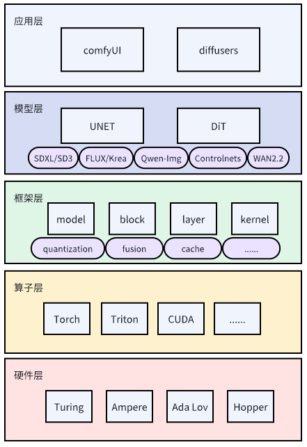
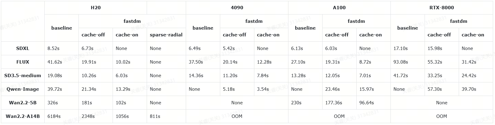

[English ReadME](README_en.md) | [中文 ReadME](README.md)

### 简介

Fast Diffusion Models(FASTDM): 是一个扩散模型推理工程，它支持主流文生图/视频模型结构，支持comfyui集成，支持多种GPU架构算力卡。

工程整体结构如下：

更多内容请参考[introduction](./doc/introduction.md)

### 模型支持
业界主要有两种架构： UNET 或者 DiT, FastDM对这两种都进行了适配。
#### UNET-architecthre
[StableDiffusion-XL](https://huggingface.co/stabilityai/stable-diffusion-xl-base-1.0)

[SDXL-ControlNet](https://huggingface.co/collections/diffusers/sdxl-controlnets-64f9c35846f3f06f5abe351f)
#### DiT-architecthre
[FLUX](https://huggingface.co/black-forest-labs/FLUX.1-dev)/[FLUX-Krea](https://huggingface.co/black-forest-labs/FLUX.1-Krea-dev)/[FLUX-Kontext](https://huggingface.co/black-forest-labs/FLUX.1-Kontext-dev)

[QwenImage](https://huggingface.co/Qwen/Qwen-Image)/[Qwen-Image-Edit](https://huggingface.co/Qwen/Qwen-Image-Edit)

[StableDiffusion-3.5](https://huggingface.co/stabilityai/stable-diffusion-3.5-medium)

[Wan2.2-T2V](https://huggingface.co/Wan-AI/Wan2.2-T2V-A14B-Diffusers)

[FLUX-Controlnet](https://huggingface.co/XLabs-AI/flux-controlnet-collections)

### 安装

可以源码安装方便修改调试，也可以通过docker安装

#### 1.源码安装方式

##### 依赖环境

OS: Linux

Python: 3.9-3.12

GPU: compute capability 7.5 or higher (e.g., 4090, A100, H100, H20, RTX8000, L4 etc.).

CUDA-12.4 or later

torch 2.7 or later

##### 安装命令

- from source

    `pip install -v -e .`

    Optional: speed up build with `pip install ninja` and set MAX_JOBS=N

#### 2.Docker安装方式
- build docker

    `docker build -d Dockerfile -t fastdm:latest .`

### 使用

examples包括Text2Image, LORA, Image-Editing, Controlnet等demo, 这些例程均基于diffusers的pipeline, 详情如下。

同时, FastDM也支持comfyUI集成，具体可参考[comfyui集成](./comfyui/README.md)

#### Text2Image:

- diffusers pipeline中使用fastdm:
    使用examples/demo文件夹下的gen.py脚本生成一张图片：

    `python gen.py --model-path /path/to/FLUX.1-Krea-dev --architecture flux --height 1024 --width 2048 --steps 25 --use-fp8 --output-path ./flux-fp8.png --prompts "A frog holding a sign that says hello world"`

    使用python脚本生成图片较繁琐，通常我们想要一个方便快捷的网页UI来控制图片生成。
    
    可以使用examples/serve文件夹下的gradio_launch.py脚本快速搭建一个web服务，这样就可以通过浏览器网页触发图片生成，可灵活修改prompts与生成参数。详情请参考[gradio服务demo](./examples/serve/readme.md)

- comfyUI中使用fastdm:

    请参考[Fastdm Comfyui使用文档](./comfyui//README.md)
    
    
#### LORA:

社区中有很多lora模型带来了生成图片的真实性，多样性和丰富性。FastDM支持lora模型的加载和使用。

详情请参考[lora生成demo](./examples/lora-gen/readme.md)

#### Image-Editing:

使用examples/demo文件夹下的image_edit.py脚本对图片进行编辑(支持qwen-img-edit和FLUX.1-Kontext-dev模型):

`python image_edit.py --model-path /path/to/Image-Edit-Model --use-int8 --image-path ./ast_ride_horse.png --prompts "Change the horse's color to purple, with a flash light background."`

与Text2Image类似, 也可以使用gradio_launch.py脚本搭建一个web服务来进行图片编辑，详情请参考[gradio服务demo](./examples/serve/readme.md)

#### Controlnet:

使用examples/demo文件夹下的contrlnet_demo.py脚本, 需要修改diffusers对应pipeline的代码, 可参考examples/demo下的readme文档。

### 性能数据汇总

text2image：

  all-models: **height = 1024，width = 2048，num_inference_steps = 25**

text2video：
    
  wan-5B: **height = 704，width = 1280，num_frames = 121，num_inference_steps = 50**
    
  wan-A14B：**height = 720，width = 1280，num_frames = 81，num_inference_steps = 40**

注：以下数据中，qwen-image与wan的H20性能数据使用了[SageAttention](https://github.com/thu-ml/SageAttention), 其他模型和卡型都未使用。SageAttention性能比torch-sdpa算子有较大提升，详情可参考该[开源工程](https://github.com/thu-ml/SageAttention)。如果环境中安装了SageAttention，FastDM的CUDA-backend模式下会直接调用。

RTX-8000中Qwen-Image数据通过`--data-type float16 --width 1024 --height 1024`得出，否则会OOM，显存进一步优化中

### 模型精度测试

使用examples/evaluation文件夹下的clip_score.py和fid.py脚本计算测评分数(更多内容请参考[evaluation](./examples/evaluation/README.md))：

### Acknowledgement

We learned the design and reused code from the following projects: [Diffusers](https://github.com/huggingface/diffusers), [vLLM](https://github.com/vllm-project/vllm), [Flash-attention](https://github.com/Dao-AILab/flash-attention), [SGLang](https://github.com/sgl-project/sglang), [teacache](https://github.com/ali-vilab/TeaCache)

The cuda-backend kernels(high performance operator, [cutlass](https://github.com/NVIDIA/cutlass/tree/v4.1.0)-based gemm or self-attention-fp8) implementations adapted from vllm or sglang kernels and flash-attention. In order to clone the Cutlass source code from GitHub without using git submodule(the domestic network is often disconnected if you don't use VPN), we directly put the Cutlass header files in the csrc/include, this method is rather crude:joy:.