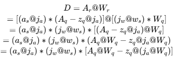
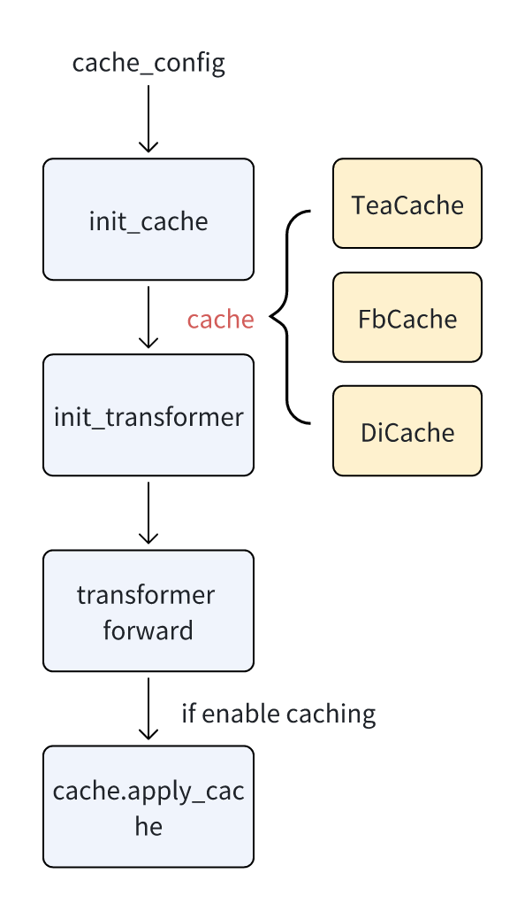
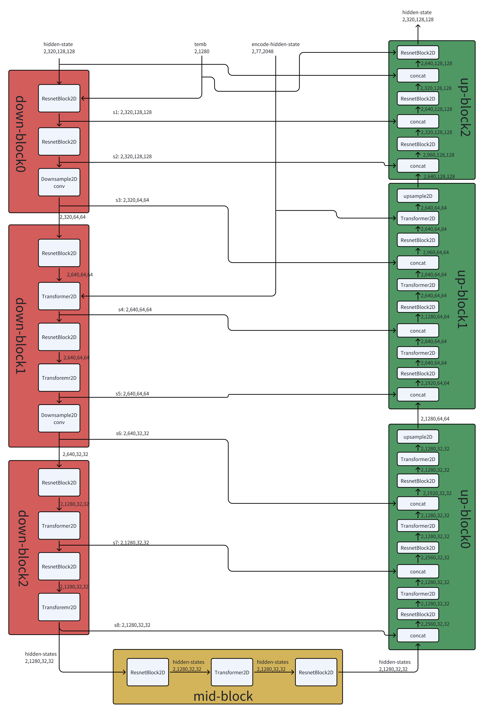
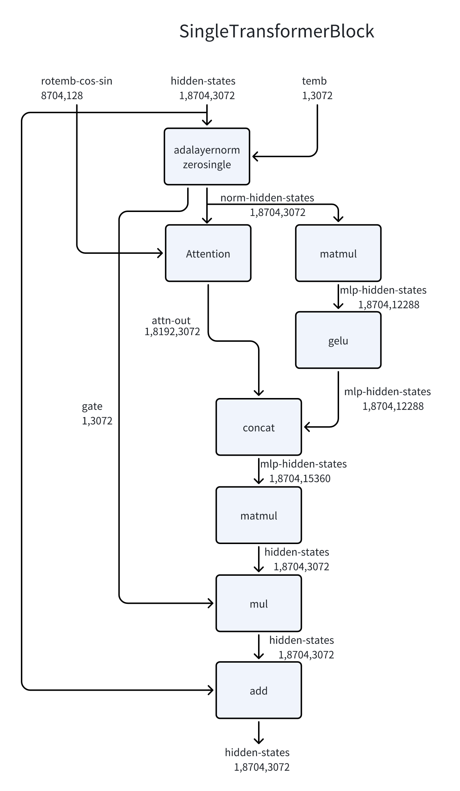

Fast Diffusion Models(FASTDM): 是一个扩散模型推理工程，已经在公司内的一些文生图业务中使用，它具备如下特点：

1. 丰富的模型支持，涵盖了主流文生图/文生视频模型架构。

2. 简洁的代码流程，轻量化框架，方便开发者或学生进行学习或调优扩散模型推理过程。

3. 推理性能好，支持多种后端算子形态，支持消费级到数据中心级的多种GPU架构的算力卡。

4. 快速业务集成能力，支持comfyUI，可快速助力产品发布。


### 模型支持
业界主要有两种架构： UNET 或者 DiT, FastDM对这两种都进行了适配。
#### UNET-architecthre
[StableDiffusion-XL](https://huggingface.co/stabilityai/stable-diffusion-xl-base-1.0)

[SDXL-ControlNet](https://huggingface.co/collections/diffusers/sdxl-controlnets-64f9c35846f3f06f5abe351f)
#### DiT-architecthre
[FLUX](https://huggingface.co/black-forest-labs/FLUX.1-dev)/[FLUX-Krea](https://huggingface.co/black-forest-labs/FLUX.1-Krea-dev)/[FLUX-Kontext](https://huggingface.co/black-forest-labs/FLUX.1-Kontext-dev)

[QwenImage](https://huggingface.co/Qwen/Qwen-Image)/[Qwen-Image-Edit](https://huggingface.co/Qwen/Qwen-Image-Edit)

[StableDiffusion-3.5](https://huggingface.co/stabilityai/stable-diffusion-3.5-medium)

[Wan2.2-T2V](https://huggingface.co/Wan-AI/Wan2.2-T2V-A14B-Diffusers)

[FLUX-Controlnet](https://huggingface.co/XLabs-AI/flux-controlnet-collections)

### 附录

### 模型量化:

为了得到更好的推理速度, FastDM支持8bit量化(fp8/int8均可), 在examples/demo的gen.py可配置"--use-fp8"，表示使用了fp8模式，在hopper/ada之前的架构卡上没有fp8支持，可以使用"--use-int8", hopper和ada卡也可以使用int8。后期也会考虑支持更低bit榨取更多算力利用率，比如int4/fp4。

无论是fp8还是int8，均采用了per-channel/per-token量化尺度，经测试，生成效果与16bit差异不大。但是如果使用[Qwen-Image](https://huggingface.co/Qwen/Qwen-Image)模型, 我们建议使用int8而不是fp8模式。

矩阵乘的int8量化，activation采用了非对称模式，weight采用对称模式，fp8量化的activation和weight均采用对称模式。所以matrixmul算子的接口，int8会比fp8多zero-point与weight-col-sum两个tensor参数，weight-col-sum是预先计算好的，用于加速推理。非对称模式量化矩阵乘推导过程如下（忽略bias，*表示逐元素乘法，@表示矩阵乘）。



其中，D是fp16/bf16的矩阵，A_r是fp16/bf16的activation，W_r是fp16/bf16的weight。A_r的反量化公式为$A_r = (a_s @ j_a) * (A_q - z_q @ j_a)$，其中a_s是per-token量化的量化因子，是一个列向量；j_a是一个全1行向量，$a_s @ j_a$的目的是将a_s广播为与A_q同shape的矩阵，$a_s @ j_a$同理；A_q是量化后的activation矩阵；z_q是非对称量化的零点，是一个列向量。W_r的反量化公式为$W_r = (j_w @ w_s) * W_q$，其中w_s是per-channel量化的量化因子，是一个行向量；j_w是一个全1列向量，$j_w @ w_s$的目的是将w_s广播为与W_q同shape的矩阵；W_q是量化后weight矩阵。

self-attention的量化，主流方法均采用per-head或更细尺度，但是这里我们采用了per-tensor且未实时统计scale而是设为1.0(FastDM中默认是关闭这个flag的)，有兴趣的同学可以探索不同方法对精度与性能的影响，强烈推荐[SageAttention](https://github.com/thu-ml/SageAttention)

### caching加速

除量化外，对于DIT模型我们还支持了cache加速机制，目前支持了[teacache](https://github.com/ali-vilab/TeaCache)、[FBcache](https://github.com/chengzeyi/ParaAttention?tab=readme-ov-file#first-block-cache-our-dynamic-caching)、[DiCache](https://github.com/Bujiazi/DiCache)等三种cache算法。

- 流程图：

    
    参数通过cache-config配置文件传入，具体参数参考[cache config demo](../examples/xcaching/configs)

    具体的cache算法原理可以阅读对应的paper，需要注意的是，每种cache算法在forward过程中会依赖当前的step或者总的step，fastdm中是通过cache_config中的current_steps_callback和total_steps_callback获取的，它俩是一个回调函数。

    在diffusers中，是借助pipeline的scheduler。
    ```python
    cache.config.current_steps_callback = lambda: pipe.scheduler.step_index
    cache.config.total_steps_callback = lambda: pipe.scheduler.timesteps.shape[0]
    ```
    在comfyui中，是根据当前的timestep再timesteps中的位置判断。
    ```python
    all_steps_sigmas = transformer_options["sample_sigmas"]
    current_steps_sigmas = transformer_options["sigmas"]
    self.model.cache.config.current_steps_callback = lambda: (all_steps_sigmas == current_steps_sigmas).nonzero().item()
    ```


- 最佳实践：

    flux：推荐Dicache, [config](../examples/xcaching/configs/dicache_flux.json);

    qwenimage/sd35: 推荐teacache, [config](../examples/xcaching/configs/teacache_qwenimage.json);

    wan2.2-t2v: 推荐fbcache, [config](../examples/xcaching/configs/fbcache_wan.json);

    目前teacache的所用的拟合参数coefficients是采用提前算好的默认值，我们还提供了coefficients拟合计算脚本，如果有需要可以通过脚本(位于examples/xcaching目录下)重新计算。

- 使用示例：

    diffusers中使用，在examples/demo的gen.py通过参数`--cache-config`配置。例：
    ```
    python gen.py --model-path /path/to/FLUX.1-Krea-dev --architecture flux --height 1024 --width 2048 --steps 25 --use-fp8 --output-path ./flux-fp8.png --prompts "A frog holding a sign that says hello world" --cache-config ../xcaching/configs/dicache_flux.json
    ```

    comfyui中是通过cache_config dict配置了默认的最佳实践cache算法，只支持配置enabel_caching、cache_threshold等参数。有需要的同学也可以自己修改nodes.py文件，只需要修改cache_config dict即可。
    ```python
    cache_config = {
        "cache_algorithm":"teacache",
        "enable_caching": use_cache,
        "threshold": cache_threshold,
        "negtive_cache": False,
        "coefficients": [5.02516305e+04, -1.71350998e+04,  1.81247682e+03, -6.99267532e+01, 9.39706146e-01],
    }
    cache = AutoCache.from_dict(cache_config)
    ```


### 模型结构

#### SDXL

sdxl整体结构如下所示：


sdxl的主要模块为unet，结构如下所示：



#### FLUX

flux整体结构如下所示：


flux的主要模块为fluxtransformer，结构如下所示：


fluxtransformer包括transformerblock与singletransformerblock，结构如下所示：


singletransformer

