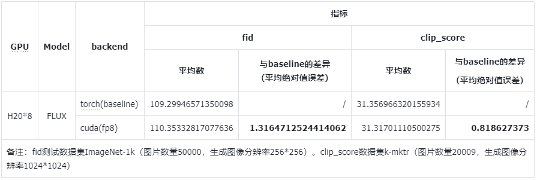

FastDM evaluation:  the quality of the generated image is evaluated using clip_score and fid.  

<br>

# Accuracy for Model flux


<br>

# Prepare

1. In order to compute clip_score, please download Dataset [k-mktr/improved-flux-prompts-photoreal-portrait](https://huggingface.co/datasets/k-mktr/improved-flux-prompts-photoreal-portrait) and Model [zer0int/LongCLIP-GmP-ViT-L-14](https://huggingface.co/zer0int/LongCLIP-GmP-ViT-L-14).
2. In order to compute fid, please download Dataset [ILSVRC/imagenet-1k](https://huggingface.co/datasets/ILSVRC/imagenet-1k).

<br>

# Clip_score  

There are two steps for evaluating using clip_score:  

1. Generate images and compute clip_score
2. Analyze between baseline and quantization

## Step 1: generate images and compute clip_score

### Step 1.1: baseline

```shell
python clip_score.py \
 --model-path /input_path/to/flux/ckpt \
 --architecture flux \
 --validate-model-path zer0int/LongCLIP-GmP-ViT-L-14 \
 --enable-dataset \
 --batch-size 1 \
 --dataset-path prompts.jsonl \
 --data-parallel \
 --devices 0 1 2 3 4 5 6 7 \
 --save-path /output_path/to/images \
 --kernel-backend torch/cuda/triton
```

### Step 1.2: quantization

```shell
python clip_score.py \
 --model-path /input_path/to/flux/ckpt \
 --architecture flux \
 --validate-model-path zer0int/LongCLIP-GmP-ViT-L-14 \
 --enable-dataset \
 --batch-size 1 \
 --dataset-path prompts.jsonl \
 --data-parallel \
 --devices 0 1 2 3 4 5 6 7 \
 --save-path /output_path/to/images \
 --kernel-backend torch/cuda/triton \
 --use-fp8
```

## Step 2: analyze between baseline and quantization

```shell
python clip_score.py \
 --compute-clip-score-error \
 --baseline-clip-score-path /input_path/to/baseline/images \
 --quant-clip-score-path /input_path/to/quantization/images \
 --clip-score-error-path /output_path/to/output.csv
```

> The baseline_clip_score_path is the save_path in Step 1.1.  
> The quant_clip_score_path is save_path in Step 1.2.

<br>

# Fid

There are two steps for evaluating using fid:  

1. Generate images and compute fid
2. Analyze between baseline and quantization

## Step 1: generate images and compute fid  

### Step 1.1: baseline

```shell
python fid.py \
 --height 256 \
 --width 256 \
 --enable-dataset \
 --batch-size 1 \
 --prompts-path id2class.json \
 --real-images-path /input_path/to/real/images \
 --model-path /input_path/to/flux/ckpt \
 --architecture flux \
 --save-path /output_path/to/images \
 --data-parallel \
 --devices 0 1 2 3 4 5 6 7 \
 --kernel-backend torch/cuda/triton
```

### Step 1.2: quantization

```shell
python fid.py \
 --height 256 \
 --width 256 \
 --enable-dataset \
 --batch-size 1 \
 --prompts-path id2class.json \
 --real-images-path /input_path/to/real/images \
 --model-path /input_path/to/flux/ckpt \
 --architecture flux \
 --save-path /output_path/to/images \
 --data-parallel \
 --devices 0 1 2 3 4 5 6 7 \
 --kernel-backend torch/cuda/triton \
 --use-fp8
```

## Step 2: analyze between baseline and quantization

```shell
python fid.py \
 --enable-get-fid-error \
 --baseline-path /input_path/to/baseline/images \
 --quantization-path /input_path/to/quantization/images \
 --csv-path /output_path/to/output.csv
```

> The baseline_clip_score_path is the save_path in Step 1.1.  
> The quant_clip_score_path is save_path in Step 1.2.

