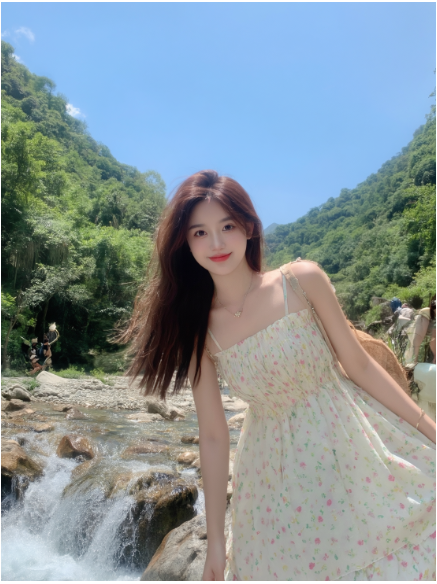
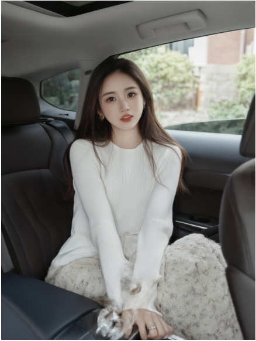
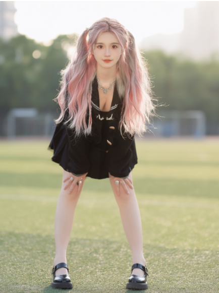
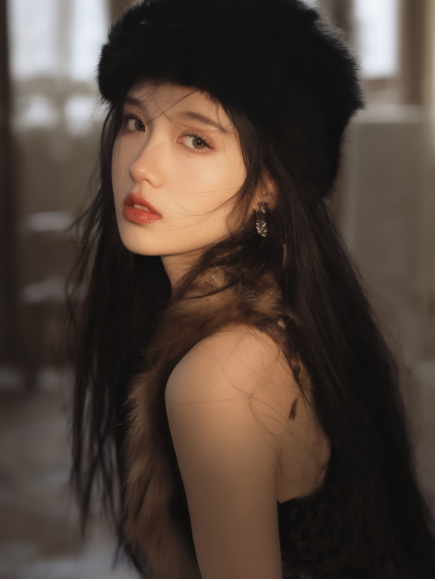
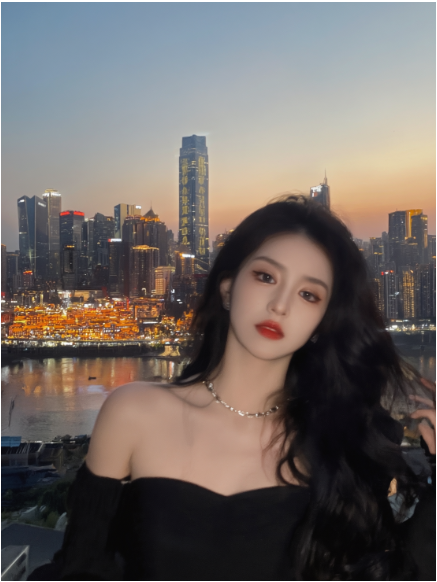

### 生图模型

使用lora模型生成图片(以qwen-image写实风格lora为例)

1. 下载lora模型（model-scope，qwen-kook-xieshi）：

`git clone https://www.modelscope.cn/KookYan/Kook_xieshi_Kook_Qwen.git`

2. 合并lora模型到原始模型：

`python lora_merge.py --model-path /path/to/Qwen-Image --lora-path /path/to/Kook_xieshi_Kook_Qwen --merged-model-path /path/to/qwen-lora-merged --convert-lora`

3. 生成图片(beautiful girls)：

以下示例prompt来自[作品集promts](https://www.modelscope.cn/KookYan/Kook_xieshi_Kook_Qwen.git)

`cd ../demo`

`python gen.py --model-path /path/to/qwen-lora-merged --architecture qwen --height 1472 --width 1104 --steps 30 --guidance-scale 4.0 --use-int8 --output-path ./qwen-merge.png --num-warmup-runs 0 --seed 123 --prompts "小红书美女，旅游，拍照，小红书风格， 自然，蓝天，绿树，小溪，瀑布，石子，徒步，山，游客,半身照,sweet girl"`

`python gen.py --model-path /path/to/qwen-lora-merged --architecture qwen --height 1472 --width 1104 --steps 30 --guidance-scale 4.0 --use-int8 --output-path ./qwen-merge-kook-int8-girl.png --num-warmup-runs 0 --seed 123 --prompts "cjzxz,beauty,The image is a high-resolution photograph of a young Asian woman sitting in the back seat of a car. She has long,straight,dark brown hair that cascades past her shoulders,framing her delicate,oval face. Her skin is fair and smooth,with a natural glow. She has large,expressive brown eyes,arched eyebrows,and a slight smile with her lips slightly parted,revealing a hint of her teeth. Her facial features are well-defined,giving her a youthful and elegant appearance., She is wearing a white,ribbed,long-sleeved sweater that has a relaxed fit,and a beige,textured skirt with a floral pattern. Her outfit is casual yet stylish. She accessorizes with a pair of small,round,gold hoop earrings and a delicate silver ring on her right index finger., The car's interior is modern and luxurious,with dark leather seats and a sleek dashboard. The background outside the car window shows a blurred view of a garden with green foliage and a brick building,suggesting a suburban or urban setting. The overall mood of the photograph is calm and serene,with soft natural light enhancing the subject's features and the car's interior,"`

`python gen.py --model-path /path/to/qwen-lora-merged --architecture qwen --height 1472 --width 1104 --steps 30 --guidance-scale 4.0 --use-int8 --output-path ./qwen-merge-kook-int8-girl.png --num-warmup-runs 0 --seed 123 --prompts "一张照片级写实的肖像拍摄,一张逼真的特写镜头照片,照片中的美少女留着长长的粉色白色渐变,微卷的发型,编着双马,穿着黑色的校园jk制服和银色项链,露出乳沟,用,棕色眼睛,有着性感的身材,丰满的乳房,站立在校园的操场上,有着一双让人羡慕的大长腿,脚上穿着黑色的玛丽珍鞋,左手戴着一枚银戒指,脖子上挂着一个菱形吊坠项链,她的身材苗条,光线从背后照射,柔和温暖,"`

`python gen.py --model-path /path/to/qwen-lora-merged --architecture qwen --height 1472 --width 1104 --steps 30 --guidance-scale 4.0 --use-int8 --output-path ./qwen-merge-kook-int8-girl.png --num-warmup-runs 0 --seed 123 --prompts "a photo-realistic portrait shoot from a close-up camera angle about a young woman with long black hair wearing a black hat and a fur collar,looking slightly to the side with a thoughtful expression,the image also shows a soft,warm light illuminating her face and upper body,on the middle of the image,a woman appears to be in her late teens or early twenties,with light brown eyes and a calm,serene expression,she has a slim body and is wearing earrings,her hair is long and black,falling down her back,her lips are parted slightly,and she is wearing a fur trim around her neck,the background is blurred,but it seems to be an indoor setting with natural light coming from a window,the overall mood is calm and contemplative,"`

`python gen.py --model-path /path/to/qwen-lora-merged --architecture qwen --height 1472 --width 1104 --steps 40 --guidance-scale 4.0 --use-int8 --output-path ./qwen-merge-kook-int8-girl.png --num-warmup-runs 0 --seed 156 --prompts "小红书风格，一位亚洲女性的照片，她有着长长的黑色波浪卷发和白皙的皮肤，日落时分站在城市风景前，背后是重庆洪崖洞夜景。她涂着红色口红，身着一件露肩黑色上衣，露出锁骨和一条精致的银色项链。她表情平静且略带诱惑，头微微向右转。背景是一座城市，建筑物灯火通明，有一条河流，天际线中既有高楼大厦，也有小型建筑。天空呈现出橙色和蓝色的渐变色，表明是黄昏时分。这位女性的脸稍有模糊，给画面增添了一种柔和、梦幻的效果。她右手轻轻抚着头发，为她的姿势增添了一抹优雅。整体光线柔和，突出了她的容貌以及身后夜晚的城市风光，小红书风格"`

### 视频模型

Wan2.2-A14B推理耗时非常长，影响体验。[Wan2.2-Lightning](https://github.com/ModelTC/Wan2.2-Lightning)采用蒸馏技术大幅减少视频生成步数。

FastDM采用diffusers pipeline运行wan模型，但lightning权重并不支持diffusers格式，FastDM提供merge脚本对lora权重进行合并，也可直接下载我们合并好的[权重](https://huggingface.co/FastDM/Wan2.2-T2V-A14B-Merge-Lightning-V1.0-Diffusers)。