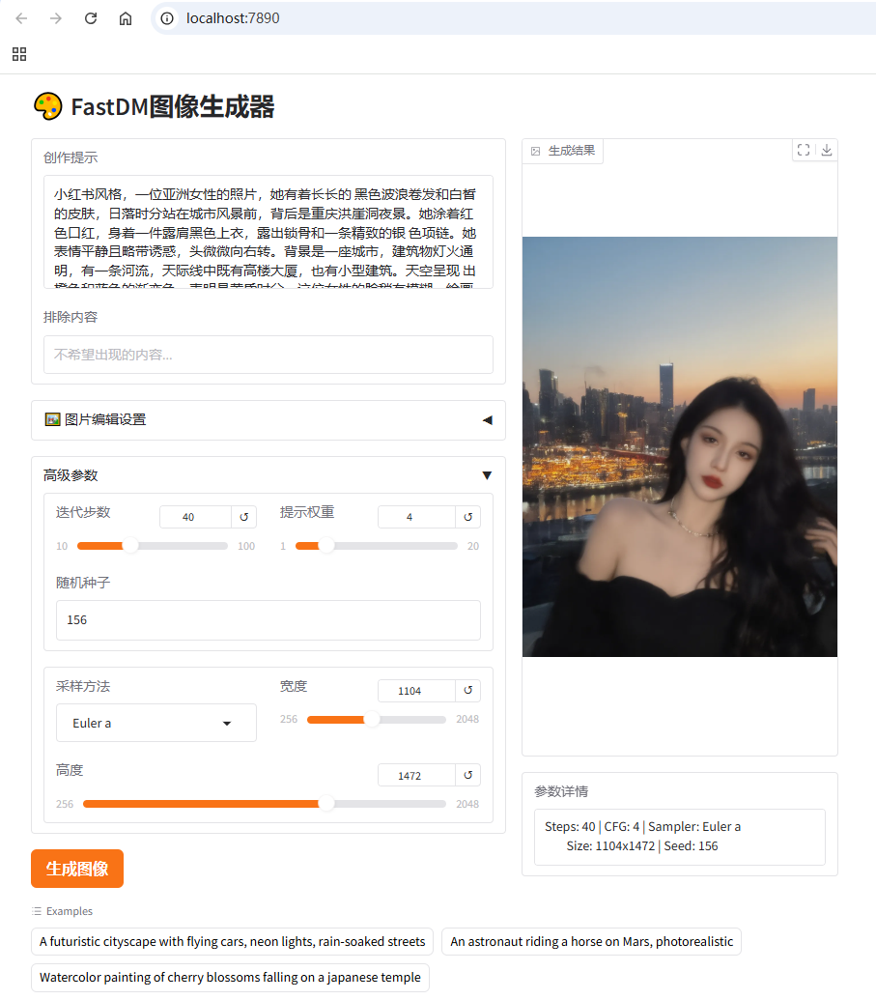

### install dependencies:

`pip install gradio`

**注**: 直接安装gradio起服务，如果遇到`ERROR: Exception in ASGI application`的问题，可通过降低pydantic版本来解决:

`pip install pydantic==2.10.6`

### launch server:

`python gradio_launch.py --model-path /path/to/qwen-image --use-int8 --architecture qwen --device 0 --cache-config ../xcaching/configs/qwenimage.json --port 7890`

对于Qwen-Image模型，配置`--qwen-oom-resolve`可以在A100-40GB，3090-48G，RTX8000卡上运行避免出现OOM error。如果使用显存大于60GB的卡，不建议使能该选项。

server启动之后在浏览器中打开 http://localhost:7890 即可访问服务(如下图所示)。

**注**: 如果FastDM运行在远程服务器中，想在本地计算机浏览器中访问该网址，建议使用vscode的terminal来起服务，这样可以直接访问。否则可能需要映射ssh才能访问服务器中起的服务。

该服务也支持**Image-Editing**任务，在‘图片编辑设置’区域输入原始图片即可。注意这需要载入[Qwen-Image-Edit](https://huggingface.co/Qwen/Qwen-Image-Edit)或[FLUX-Kontext](https://huggingface.co/black-forest-labs/FLUX.1-Kontext-dev)模型，使用文生图模型会报error。

